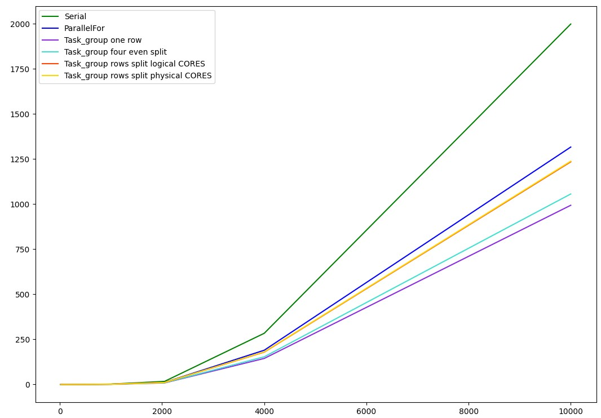

# matrix_multiplication_TBB
### Results
Program was executed on Intel i5-6300 CPU 2.5 GHz machine with 2 physical and 4 logical cores

Graph of results. X axis - time | Y axis - dimensions of input matrices

#### Speed up
| Type of parallel implementation      |	Speed up |
| ------------------------------------ | --------- |
| Parallel for	                       | 1.503x    |
| Task group one row for each task     | 1.998x    |
| Task group four even split	         | 1.863x    |
| Task group rows split logical cores	 | 1.594x    |
| Task group rows split physical cores | 1.579x    |

